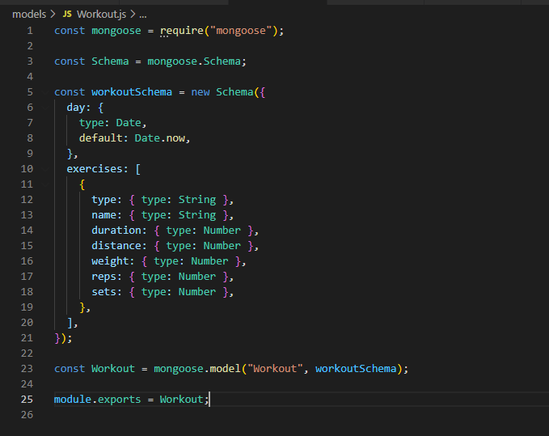
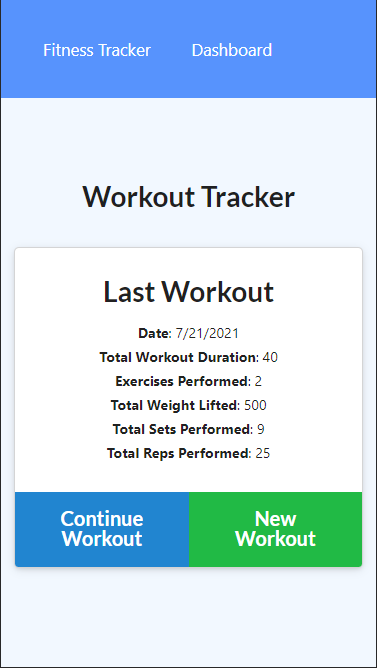
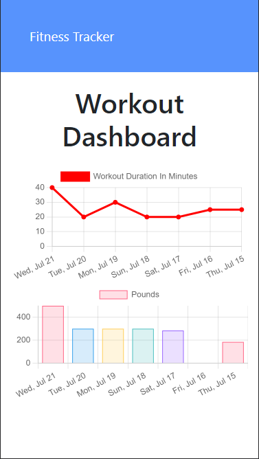

# Unit 18 NoSQL Homework: Workout Tracker

This is a **workout tracker** web application that uses **Mongo** as the persistent storage, **Mongoose** as the object modelling, **ExpressJS** as the web framework, and **NodeJS** as the Javascript runtime environment. The application is described in the following user story, business context, and acceptance criteria:

## User Story

- As a user, I want to be able to view create and track daily workouts. I want to be able to log multiple exercises in a workout on a given day. I should also be able to track the name, type, weight, sets, reps, and duration of exercise. If the exercise is a cardio exercise, I should be able to track my distance traveled.

## Business Context

A consumer will reach their fitness goals more quickly when they track their workout progress.

## Acceptance Criteria

When the user loads the page, they should be given the option to create a new workout or continue with their last workout.

The user should be able to:

- Add exercises to the most recent workout plan.

- Add new exercises to a new workout plan.

- View the combined weight of multiple exercises from the past seven workouts on the `stats` page.

- View the total duration of each workout from the past seven workouts on the `stats` page.

## Implementation

- [Features](#features)
- [Installation](#installation)
- [Usage](#usage)
- [License](#license)

## Features

On the technical architecture, the application features the use of the MVC paradigm with **Database Schemas**, the logical structure of the database, defined with **Mongoose** and persisting in **MongoDb**; **HTML** to enable the input and rendering of the application data; **Express.Js** for route handling, and **Node.Js** for Javascript running.

The application uses a _Workout_ model hosted on a **NoSQL** database, **MongoDb**. The model structure includes the following fields: _day_, of type Date; and an array of _exercises_, documents defining the _type_ of exercise, _name_, _duration_, _distance_, _weight_, _reps_, and _sets_. Because of the flexibility that a **NoSQL** database provides, the model structured is altered during program execution to include an added field to define the _totalDuration_ of the workout as an **aggregation pipeline**, or the sum of the individual exercises' duration.



Functionally, the application allows users to perform the following CRUD operations:

- Create a workout
- Retrieve the last or all workouts
- Update a workout by id



The application also allows users to view the workout statistics corresponding to weight lifting and duration by day using line and bar charts.



## Installation

The application requires [Node.Js](https://nodejs.org/en/) Runtime Library, [Express.js](https://www.npmjs.com/package/express), and [Mongoose](https://www.npmjs.com/package/mongoose) libraries, along with a running _local_ instance of [MongoDb](https://www.mongodb.com/), or a _cloud_ instance of **MongoDb** known as [Atlas](https://www.mongodb.com/cloud/atlas).

A JSON file containing these dependencies is included with this project. To set up the development environment for the application, simply run the following command:

```bash
npm install
```

Using **Node.Js** console, run the following command to seed the database with sample data:

```bash
npm run seed
```

A video demonstrating how to seed a similar database from the command line is provided [here](https://drive.google.com/file/d/1cxB7I41wX6AWwSDz2RDOpIf9_2EbgBuZ/view).

Once the database is created and seeded with sample data, run the following command to start the application:

```bash
node server.js
```

## Usage

The application has been coded to perform CRUD operations against a live **MongoDb** database using the most common HTTP methods for REST APIs: _GET_, _POST_, and _PUT_. If you want to run the application in your development environment, make sure to follow the [Installation](#installation) instructions above; otherwise, a live instance can be tested in [Heroku](https://ku-cbc-workout-tracker.herokuapp.com/), which connects to a live **MongoDb Atlas** database.

In addition, the application has been coded with a _mobile first_ approach in mind.

## License

This project is licensed under The MIT License. Refer to https://opensource.org/licenses/MIT for more information of what you can and cannot do with this project. See contact information below if you have questions, comments, or suggestions for the project.

## Contributing Guidelines

Want to contribute to this project? You may clone or fork the project in GitHub. Note the licesing information referred in this file.

## Contact Information

For questions, comments, or suggestions, please contact me by E-Mail:

japinell@yahoo.com

Check out my other **cool** projects in GitHub - https://github.com/japinell

## License

This application is licensed under the following license:

[](https://opensource.org/licenses/MIT)(https://opensource.org/licenses/MIT)
